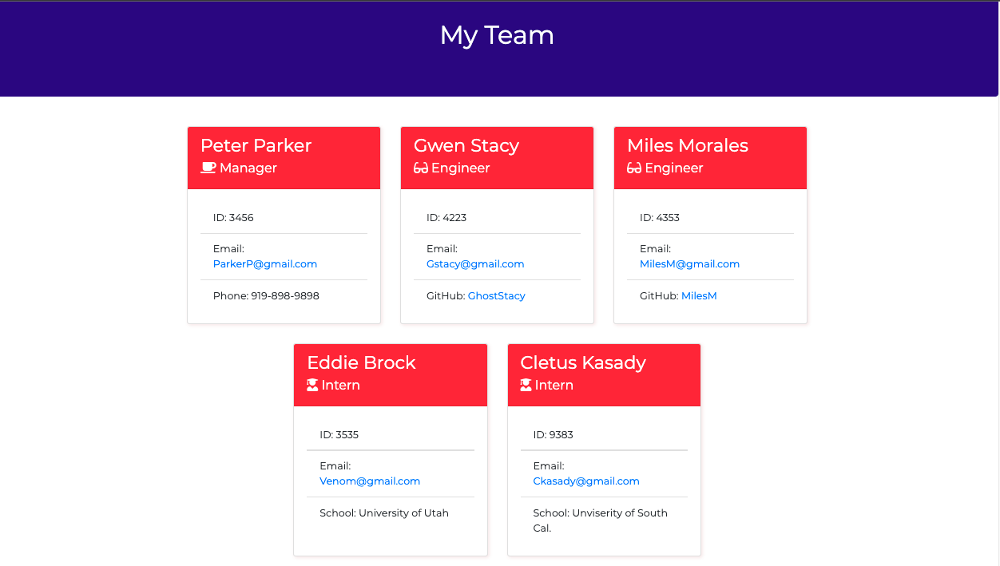

# Team Profile Generator
[](https://opensource.org/licenses/MIT)

## Description:
A Command Line Interface Application developed as homework for coding bootcamp.
The tests were provided and the assignment was to build a CLI application that passed the test created a stylized TML file. 

## Table of Contents:
* [Installation](#installation-instructions)
* [Usage](#usage)
* [Tests](#tests)
* [File Tree](#file-tree)
* [Questions](#questions)
* [License](#license-info)

## Installation Instructions
Fork, Clone, or Download and then install dependencies
```
npm install
```
Run the Interface:
```
npm start
```

## Usage
This application requires node.js. Run the following to begin:
```
node index.js
```
You will then be prompted to answer some information on your team that will display on the webpage out put located in the ./dist folder



## Demo
Here is a demo of the project
:tv: [Demo](https://drive.google.com/file/d/1CP9U85HbmCFVF7PKkabTSw37ZruYWUgO/view?usp=sharing) 

## Usage
* Start the project in your terminal by entering `npm start` and follow the prompts to enter team member dataa.
* Once you indicate there are no more team members to enter, the application will generate a static HTML page with the team member data.
* If you run the application again, the previous data will overwrite the `team.html` file! If you want to save your work be sure to copy the enter output folder into another folder so the `style.css`and html background picture will persist.

## Tests
There are pre-coded tests utilizing npm jest built into the application, Simply type `npm run test` into the terminal to see those tests.
Other tests include:
* WHEN the user starts the program,
* THEN manager information is requested including an office menu
* WHEN the user selects to enter engineer data,
* THEN user is prompted to enter information excluding a phone number but including a Github username
* WHEN the user selects to enter intern data,
* THEN the user is prompted to enter information excluding a phone number or Github account, but including a school name.
* WHEN the user selects no more employees to enter
* THEN the application renders a stylized HTML file presenting cards with team member data.

## Questions
If you have any questions please email me at [codyktestakis@gmail.com](mailto:codyktesetakis@gmail.com)

## License
Copyright - 2021 - present Cody Ktestakis
This project is licensed under the terms of the MIT license.
More information is available at [opensource.org/licenses](https://opensource.org/licenses/MIT)

